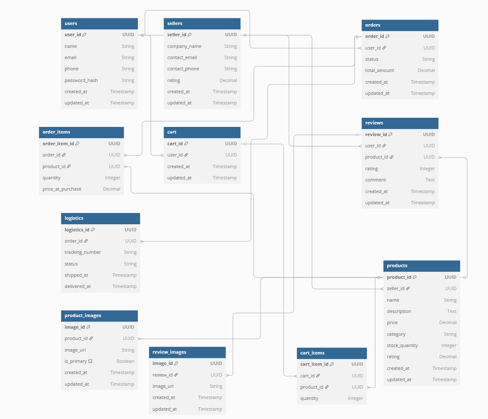
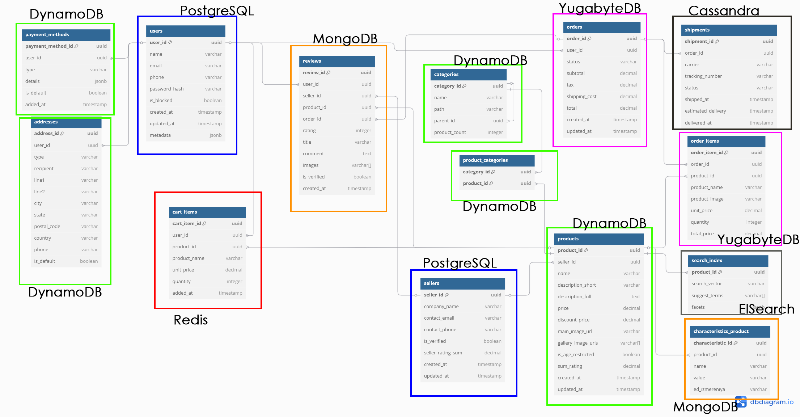

# highload-cource-work-2025-2-amazon

## **1. Тема и целевая аудитория**

### **1.1 Тема курсовой работы**

Amazon (Amazon.com, Inc.) — американская компания, крупнейшая в мире на рынках платформ электронной коммерции, предоставляющая пользователям возможность покупать и продавать товары

---

### **1.2. Целевая аудитория**

- **Покупатели** – пользователи платформы, покупают товары, их большинство
- **Продавцы** – предприниматели и компании, продают товары
- **Партнеры по логистике** – службы доставки и возврата, службы ремонта техники по гарантии

---

### **1.3. Анализ трафика и вовлеченности**

- **Всего посещений (за месяц, данные за августь 2025):** 2.7B  [[1]](https://www.similarweb.com/website/amazon.com/)
- **Средняя продолжительность сеанса:** 6 минут [[1]](https://www.similarweb.com/website/amazon.com/)
- **Среднее количество просмотров страниц за посещение:** 9.4 [[1]](https://www.similarweb.com/website/amazon.com/)
- **Процент отказов:** ~31% [[1]](https://www.similarweb.com/website/amazon.com/)
- **Количество активных продавцов:** 9M+ на момент 2021 года [[2]](https://www.marketplacepulse.com/amazon/number-of-sellers)
- **Пользователи Amazon Prime:** 240M+ на момент лета 2025 года [[3]](https://salesduo.com/blog/amazon-statistics/)

_(Информация взята с сайта SimilarWeb [[1]](https://www.similarweb.com/website/amazon.com/) и из внутренних отчетов Amazon [[4]](https://www.demandsage.com/amazon-statistics/) )_

### **1.4. Функционал MVP**

#### **Пользовательский функционал**

- **Регистрация и авторизация пользователей** (e-mail, телефон, социальные сети)
- **Каталог товаров и услуг**
  - Просмотр товаров по категориям
  - Фильтрация и сортировка
  - поиск товаров
- **Карточка товара**
  - Описание, фотографии, характеристики
  - Отзывы и рейтинги
  - Добавление товара в избранное
- **Корзина и оформление заказа**
  - Добавление товаров в корзину
  - Выбор способа доставки
  - Оплата (карты)
- **Личный кабинет**
  - История заказов
  - Адреса доставки

#### **Функционал для продавцов**

- Регистрация и верификация юрлица для продажи на площадке
- Создание  страниц товаров
- Управление заказами и возвратами

#### **Функционал для логистики**

- Отслеживание заказов
- Обращение по гарантии

---

Распределение нагрузки по странам [[5]](https://www.semrush.com/website/amazon.com/overview/)

| Country      | Share (%) | Visits     | Desktop (%) | Mobile |
|--------------|-----------|------------|-------------|--------|
| США          | 83.12%    | 2.13B      | 38.68%      | 61.32% |
| Индия        | 1.91%     | 48.83M     | 30.36%      | 69.64% |
| Канада       | 0.86%     | 21.94M     | 48.52%      | 51.48% |
| Бразилия     | 0.79%     | 20.10M     | 36.44%      | 63.56% |
| Мексика      | 0.75%     | 19.15M     | 30.24%      | 69.76% |

---

## **2. Расчет нагрузки**

### **2.1 Основные метрики**

-  MAU* (Monthly Active Users desktop) = 300M [[7]](https://analyzify.com/statsup/amazon)
-  DAU* (Daily Active Users desktop) = 60M [[7]](https://analyzify.com/statsup/amazon)

Расчёт:
<i>DAU = 0.2×300M = 60M</i>

Так как analizify не собирает метрики с мобильных устройств через приложение Amazon, то можно примерно подсчитать MAU и DAU исходя из сравнения с другими источниками

Anual Active CUstomers (AAC) для Amazon за 2021 = 315 Million Customers

AAC для Alibaba.com за 2021 [20] = 779M Customers

Можно предположить количество пользователей через мобильные устройства пропорционально соотношению годовых покупателей в Alibaba к их мобильным пользователям за месяц

MAU мобильных пользователей для Alibaba [21] = 902M

Тогда получается следующее примерное соотношение:

        (AAC Amazon) / (MAU mobile Amazon) = (AAC Alibaba) / (MAU mobile Alibaba) =>
         =>   (MAU mobile Amazon) =  ((AAC Amazon) * (MAU mobile Alibaba)) / (AAC Alibaba)
        (MAU mobile Amazon) = (315M * 902M) / (779M) ~= 665M

Но Alibaba вырос за эти годы, и его AAC на 2025 год ~= 1.31 Billion ~= 1310M, 
  тогда можно предположить, что и MAU пропорционально выросло: 
  
        MAU* = (1310M / 779M) * 902M = 1517M (68%)    

Тогда можно предположить, что и MAU mobile для Amazon возрос примерно на 68%:
        
        MAU mobile Amazon = 665M * 1.68 ~= 1117M ~= 1.117B

Тогда суммарный MAU для десктопа и для мобильных устройств будет: MAU summ = MAU desktop + MAU mobile = 300 + 665

<b> => MAU summ = 300M + 1117M ~= 1417M ~= 1.42B </b> 

Тогда:

  <b> DAU = 1417M * 0.2 = 284M </b> 

Итого:
- #### MAU = 1417M
- #### DAU = 284M

#### Действия пользователей

| Тип пользователя | Метрика (количество на 1 пользователя в день)   | Число                                                                                                                                                                                                                              |
| ---------------- | ------------------------------------------------ | ---------------------------------------------------------------------------------------------------------------------------------------------------------------------------------------------------------------------------------- |
| Покупатель       | Среднее количество просмотров страниц с подборкой товаров за сессию  | 8                                                                                                                                                                                                                                  |
| Покупатель       | Количество сессий в день                         | 2                                                                                                                                                                                                                                  |
| Покупатель       | Количество оставленных отзывов за день           | 0.13 [[8]](https://meetanshi.com/blog/amazon-seller-statistics/)[[9]](https://www.powerreviews.com/wp-content/uploads/2023/10/2023-Ratings-Reviews-Report_-Amazon-Edition-1.pdf)                                                   |
| Покупатель       | Количество добавленных товаров в корзину за день | 3 [[12]](https://shopney.co/blog/ultimate-guide-to-increase-add-to-cart-rates/)                                                                                                                                                    |
| Покупатель       | Количество покупок за день                       | 0.19 [[11]](https://amzscout.net/blog/amazon-statistics/)                                                                                                                                                                          |
| Покупатель       | Количество платежей за день                      | 0.19 [[11]](https://amzscout.net/blog/amazon-statistics/)                                                                                                                                                                          |
| Продавец         | Создание карточек товаров в день                 | 0.7                                                                                                                                                                                                                                |
| Покупатель       | Поисковых запросов за день                      | 1.03          |
| Продавец         | Количество отправляемых посылок в день           | 0.6 [[6]](https://www.feedough.com/amazon-statistics-usage-revenue-key-facts/)                                                                                                                                                     |
| Продавец         | Количество возвращаемых посылок в день           | 0.1 [[10]](https://nichesources.com/amazon-return-rate.html#:~:text=Amazon's%20return%20rate%20for%20online,support%20can%20help%20reduce%20returns.)                                                                              |
| Логистика        | Количество перемещаемых посылок в день           | 1.76M [[6]](https://www.feedough.com/amazon-statistics-usage-revenue-key-facts/) [[10]](https://nichesources.com/amazon-return-rate.html#:~:text=Amazon's%20return%20rate%20for%20online,support%20can%20help%20reduce%20returns.) |

  
Из рассчета, что за 2023 год было продано боле 4.5 млрд товаров [[8]](https://meetanshi.com/blog/amazon-seller-statistics/), а в среднем на карточку товара приходится 40 отзывов [[9]](https://www.powerreviews.com/wp-content/uploads/2023/10/2023-Ratings-Reviews-Report_-Amazon-Edition-1.pdf), то 4.5млрд x 40 = 180млрд 
180млрд/(MAU x 12) = 27 - примерное количество отзывов, оставляемое одним пользователем за год

Из рассчета 1,6M - количество посылок, отправляемых в день [[6]](https://www.feedough.com/amazon-statistics-usage-revenue-key-facts/), а активных продавцов 2.3M [[6]](https://www.feedough.com/amazon-statistics-usage-revenue-key-facts/), то  
1.6M/2.3M = 0.6 - количество посылок, отправляемых среднестатистич. продавцом в день

Процент возвратов на Amazon варируется между 5% и 15% --> среднее значение 10% 
Тогда количество возвращаемых посылок в день 10% от 0.6 = 0.06 = 0.1 [[10]](https://nichesources.com/amazon-return-rate.html#:~:text=Amazon's%20return%20rate%20for%20online,support%20can%20help%20reduce%20returns.)

Из рассчета 1,6M - количество посылок, отправляемых в день [[6]](https://www.feedough.com/amazon-statistics-usage-revenue-key-facts/), а возвращаемых - 10% от этого числа [[10]](https://nichesources.com/amazon-return-rate.html#:~:text=Amazon's%20return%20rate%20for%20online,support%20can%20help%20reduce%20returns.), то  
1.6M + 1.6M x 0.1 = 1.76M

Будем считать, что пользователь обновляет/подтверждает свои учетные данные один раз за год. 
Тогда 1/356 = 0.003

Из рассчета, что на сервисе в день 114M пользователей, и в день продается 12M товаров [[11]](https://amzscout.net/blog/amazon-statistics/), то 
12M/114M = 0.105 - количество покупаемых товаров пользователем в день = количество платежей в день

Из рассчета, что у пользователя 2 сессии в день, за которые он просматривает по 8 страниц по 35 товаров на странице, а конверсия с просмотра составляет 8% [[12]](https://shopney.co/blog/ultimate-guide-to-increase-add-to-cart-rates/), то 
2 x 8 x 35 x 0.08 x 0.08 = 3.5 => 4 товара в день пользователь добавляет в корзину

Точной статистики по поиску для Амазон у нас нет, поэтому будем отталкиваться от статистики по схожему сервису -- Reddit. 
Согласно [[16]](https://backlinko.com/reddit-users) за декабрь 2024 было совершенно в среднем 40 миллионов поисковых запросов в день. Один пользователь совершает ежедневно 40 млн / 110 млн (DAU) = 0.36 поисковых запросов. Информация касательно ленты рекомендаций на сервисе публично не разглашается, поэтому буду отталкиваться от статистики по количеству визитов за месяц и по среднему времени одной сессии.

Так как у нас DAU = 284М =>

  <b>    Один пользователь совершает 0.36*284/110 = 1.03 поисковых запросов в день. </b>

---

### **2.2 Технические метрики**

### RPS

| Тип пользователя | Параметр (количество на 1 пользователя в день)   | Action(число) | RPS        | RPS x3     |
| ---------------- | ------------------------------------------------ | ------------- | --------   | ---------  |
| Покупатель       | Регистрация, авторизация, обновление профиля     | 0.003         | 4.085      | 12.255     |
| Покупатель       | Среднее количество просмотров страниц за сессию  | 8             | 10907.406  | 32722.218  |
| Покупатель       | Количество сессий в день                         | 2             | 272684.2   | 818052.6   |
| Покупатель       | Количество оставленных отзывов за день           | 0.13          | 177.232    | 531.696    |
| Покупатель       | Количество добавленных товаров в корзину за день | 3             | 4090.263   | 12270.789  |
| Покупатель       | Количество покупок за день                       | 0.19          | 259.046    | 777.138    |
| Покупатель       | Количество платежей за день                      | 0.19          | 259.046    | 777.138    |
| Покупатель       | Поисковых запросов за день                       | 1.03          | 1404.302   | 4212.906   |
| Продавец         | Регистрация, верификация, обновление профиля     | 0.003         | 0.133      | 0.399      |
| Продавец         | Создание карточек товаров в день                 | 0.7           | 3.534      | 10.602     |
| Продавец         | Количество отправляемых посылок в день           | 0.6           | 1,59       | 4,77       |
| Продавец         | Количество возвращаемых посылок в день           | 0.1           | 0,26       | 0,78       |
| Логистика        | Количество перемещаемых посылок в день           | 1.76M         | 20,37      | 61,11      |
| Total            |                                                  |               | 291125.037 | 873375.111 |

#### Итого:

RPS = (Action x DAU)/(24h x 60' x 60") 
DAU пользователей = 284М 
DAU продавцов = 4.37M 

---

### Нагрузка на сеть со стороны пользователей

#### Рассчетные параметры карточки товара

Тестовые данные [[13]](https://www.amazon.com/)
| Параметр | Число |
| --------------------------------------------- | ------ |
| Средний размер товарного описания | 100 Кб |
| Среднее количество фотографий у товара | 6 |
| Средний размер фотографии | 250 Кб |
| Среднее количество карточек на одной странице | 35 |

### Рассчет действий среднестатистич. покупателя

Просмотр товаров в день: 2 сессии x 8 страниц x 35 товаров x (100Кб + (6 фото x 250Кб)) = 896000 Кб = 875Мб

#### Итого:
875Мб на одного человека в день

#### Поисковой запрос:
  35 карточек при выдаче -> (1600 КБ) * 35 = 56.000 КБ на запрос.

#### Сетевая нагрузка таблица

| Тип пользователя | Параметр (количество на 1 пользователя в день)   | Action(число) | RPS      | RPS x3    | Volume (Kb) | Сеть (Kb/s) | Сеть x3 (Kb/s) |
| ---------------- | ------------------------------------------------ | ------------- | -------- | --------- | ----------- | ----------- | -------------- |
| Покупатель       | Регистрация, авторизация, обновление профиля     | 0.003         | 4.085     | 12.255      | 10          | 40.85        | 122.55           |
| Покупатель       | Среднее количество просмотров страниц за сессию  | 8             | 10907.406 | 32 722.218 | 1600        | 17451849.6   | 52355548.8     |
| Покупатель       | Количество сессий в день                         | 2             | 272684.2 | 818052.6  | 10          | 2726842    | 8180526       |
| Покупатель       | Количество оставленных отзывов за день           | 0.13          | 177.232    | 531.696    |  50          | 8861.6       | 26584.8        |
| Покупатель       | Количество добавленных товаров в корзину за день | 3             | 4090.263 | 12270.789  | 20          | 81805.26    | 245415.78      |
| Покупатель       | Количество покупок за день                       | 0.19          | 259.046   | 777.138    | 30          | 7771.38     | 23314.14       |
| Покупатель       | Количество платежей за день                      | 0.19          | 259.046   | 777.138    | 30          | 7771.38     | 23314.14       |
| Покупатель         | Поисковых запросов за день                      | 1.03          | 1404.302   | 4212.906    | 56.000          | 29013.152         | 87039.456            |
| Продавец         | Регистрация, верификация, обновление профиля     | 0.003         | 0.133     | 0.399      | 10          | 1.33         | 4            |
| Продавец         | Создание карточек товаров в день                 | 0.7           | 3.534     | 10.602      | 1600        | 5654.4       | 16963.2          |
| Продавец         | Количество отправляемых посылок в день           | 0.6           | 1.59     | 4,77      |  100         | 159         | 477            |
| Продавец         | Количество возвращаемых посылок в день           | 0.1           | 0.26     | 0,78      | 100         | 26          | 78             |
| Логистика        | Количество перемещаемых посылок в день           | 1.76M         | 20.37    | 61,11     | 200         | 4074       | 12222         |
| Total            |                                                  |               | 9721.58  | 29164,74  |             | 20 323 870 | 60 971 609.866   |

Сеть total = 19.4 Гб/сек. 
Сеть x3 total = 58.15 Гб/сек. 

---

## **3. Глобальная балансировка нагрузки**

### **3.1. Разделить трафик на группы по характеру нагрузки**

<h3>Группа 1: Пользовательский трафик (покупатели и продавцы) (amazon.com)</h3>
<b>Регистрация, авторизация, обновление профиля:</b> Низкая частота запросов, но критически важная для безопасности и доступности. 
<b>Просмотр страниц:</b> Высокая частота запросов, большой объем данных (изображения, описания товаров). 
<b>Добавление товаров в корзину:</b> Средняя частота запросов, небольшой объем данных. 
<b>Оставление отзывов:</b> Низкая частота запросов, небольшой объем данных. 
<b>Покупки и платежи:</b> Низкая частота запросов, но критически важная для бизнеса (требует высокой отказоустойчивости и безопасности). 

<h3>Группа 2: Трафик продавцов (seller.amazon.com)</h3>
<b>Создание карточек товаров:</b> Средняя частота запросов, большой объем данных (изображения, описания). 
<b>Отправка и возврат посылок:</b> Низкая частота запросов, небольшой объем данных. 

<h3>Группа 3: Логистический трафик (logistic.amazon.com)</h3>
<b>Перемещение посылок:</b> Для этого трафика будет большая частота запросов, объем данных на хранение средний. К задержкам менее чувствителен, но требует высокой скорости получения/обновления данных. 

### **3.2. Выбрать физическое расположение датацентров (базово одного)**

[https://worldpopulationreview.com/state-rankings/state-densities]

[https://www.internetexchangemap.com/]

Для маркетплейса, расположенного в США, лучше использовать несколько датацентров в разных регионах с наибольшей аудиторией для низкой задержки. Основные регионы для размещения датацентров:

    Восточное побережье США (Вирджиния, Нью-Йорк): Для обслуживания пользователей на востоке США.

    Западное побережье США (Калифорния, Орегон): Для обслуживания пользователей на западе США.

    Центральный регион США (Техас): Для балансировки нагрузки между востоком и западом.

Расстояния между городами (в километрах):

| Город 1                   | Город 2                   | Расстояние (км) |
| ------------------------- | ------------------------- | --------------- |
| Вирджиния (Миннесота)     | Нью-Йорк                  | ~1,800 км       |
| Вирджиния (Миннесота)     | Калифорния (Лос-Анджелес) | ~2,500 км       |
| Вирджиния (Миннесота)     | Орегон (Портленд)         | ~2,300 км       |
| Вирджиния (Миннесота)     | Техас (Даллас)            | ~1,400 км       |
| Вирджиния (Миннесота)     | Иллинойс (Чикаго)         | ~800 км         |
| Нью-Йорк                  | Калифорния (Лос-Анджелес) | ~3,900 км       |
| Нью-Йорк                  | Орегон (Портленд)         | ~3,800 км       |
| Нью-Йорк                  | Техас (Даллас)            | ~2,200 км       |
| Нью-Йорк                  | Иллинойс (Чикаго)         | ~1,200 км       |
| Калифорния (Лос-Анджелес) | Орегон (Портленд)         | ~1,000 км       |
| Калифорния (Лос-Анджелес) | Техас (Даллас)            | ~1,900 км       |
| Калифорния (Лос-Анджелес) | Иллинойс (Чикаго)         | ~2,800 км       |
| Орегон (Портленд)         | Техас (Даллас)            | ~2,500 км       |
| Орегон (Портленд)         | Иллинойс (Чикаго)         | ~2,700 км       |
| Техас (Даллас)            | Иллинойс (Чикаго)         | ~1,300 км       |

Основной датацентр можно разместить в центральном регионе, лучше в Техасе или Иллинойсе, так как это обеспечит лучшую задержку для пользователей как на востоке, так и на западе.

### **3.3. Глобальная балансировка нагрузки**
<b>

- DNS-балансировка Cloudflare для распределения трафика между датацентрами (на основе геолокации пользователя)

   

- Amazon Route 53 latency-based DNS (на основе геолокации пользователя и задержки запросов)

   

- Использование health checks для автоматического перенаправления трафика в случае сбоя в одном из датацентров.

   

</b>
 
<b>Amazon Route 53</b> -- DNS сервис + балансировoвщик по latency. [[18]](http://aws.amazon.com/route53/)

<b>Cloudflare</b> -- это глобальная сеть доставки контента (CDN), будем использовать для раздачи статики (картинки, текст описания).[[19]](https://www.cloudflare.com/ru-ru/)

### **3.4. Распределение RPS по серверам в городах**

- Нью-Йорк: ~20% от общего RPS = 5,832.95
- Вирджиния: ~15% от общего RPS = 4,374.71
- Лос-Анджелес: ~25% от общего RPS = 7,291.19
- Портленд: ~10% от общего RPS = 2,916.47
- Даллас: ~15% от общего RPS = 4,374.71
- Чикаго: ~10% от общего RPS = 2,916.47

 
---

## **4. Локальная балансировка нагрузки** [[17]](https://docs.amazonaws.cn/en_us/eks/latest/userguide/aws-load-balancer-controller.html)

### Алгоритмы балансировки нагрузки

| Алгоритм                  | Плюсы                                                                   | Минусы                                             |
| ------------------------- | ----------------------------------------------------------------------- | -------------------------------------------------- |
| Round-Robin               | Равномерное распределение нагрузки, простота реализации                 | Не учитывает нагрузку на серверы                   |
| Weighted Round-Robin      | Возможность распределять нагрузку с учетом мощности серверов            | Не учитывает текущую загрузку серверов             |
| Least Connection          | Оптимально для долгих соединений, так как учитывает текущие подключения | Возможны перегрузки при резких изменениях нагрузки |
| Weighted Least Connection | Учитывает как текущие подключения, так и мощности серверов              | Сложность в настройке                              |
| IP Hash                   | Клиент всегда подключается к одному и тому же серверу                   | Неравномерное распределение нагрузки               |

### Amazon Load Balancer

### **4.1. Выбор схемы балансировки для входящих и межсервисных запросов**

- <b>Входящий трафик:</b>  Использование ALB для балансировки HTTP/S-запросов, а также NLB  (Network Load Balancing)  для низкоуровневого трафика (например, WebSockets или gRPC).

- <b>Межсервисные запросы:</b>  Балансировка через Service Mesh (например, Istio) или Kubernetes Ingress.

### **4.2. Выбор схемы отказоустойчивости**

- <b>Мультизональная балансировка:</b>  Размещение инстансов в нескольких Availability Zones.

- <b>Автоматическое переключение (failover):</b>  Использование Route 53 + Health Checks для перенаправления трафика в случае отказа.

- <b>Автошкала:</b>  Использование HPA (Horizontal Pod Autoscaler) для подстройки количества реплик под нагрузку.

### **4.3. Рассчёт нагрузки по терминации SSL**

При терминации SSL на ALB вычислительные ресурсы распределяются следующим образом:

- <b>Средняя нагрузка на ALB:</b>  1000 RPS требует около 1 vCPU.

- <b>Средний размер SSL-сессии:</b>  3 KB на подключение.

- <b>Если сервер обрабатывает 100K RPS, </b> требуется 100 vCPU ALB.

---

## **5. Масштабирование баз данных**

### **5.1 Описать логическую схему данных**

UUID:

    user_id, seller_id, product_id, order_id, cart_id, review_id, logistics_id, image_id.

INTEGER:

    stock_quantity (в таблице products), quantity (в таблицах order_items, cart_items).

TIMESTAMP:

    created_at, updated_at (во всех таблицах).

DECIMAL:

    price, total_amount, rating (в таблицах products, orders, sellers, reviews).

TEXT:

    description (в таблице products), comment (в таблице reviews).

BOOLEAN:

    is_primary (в таблице product_images).

| Таблица	       | Размер строки (байт)	| Количество записей в сутки	| Общий объем в сутки (байт) | 
| -------------- | -------------------- | --------------------------  | -------------------------- |   
| users	         | 211                  | 914193,5484                 | 192894838,7 | 
| sellers        | 155                  | 16912,58065                 | 2621450     | 
| products       | 718                  | 914193,5484                 | 656390967,7 | 
| product_images | 249                  | 5485161,29                  | 1365805161  | 
| orders         | 76                   | 54851612,9                  | 4168722581  | 
| order_items    | 60                   | 164554838,7                 | 9873290323  | 
| cart           | 48                   | 914193,5484                 | 43881290,32 | 
| cart_items     | 52                   | 2742580,645                 | 142614193,5 | 
| reviews        | 568                  | 118845,1613                 | 67504051,61 | 
| review_images  | 248                  | 237690,3226                 | 58947200    | 
| logistics      | 118                  | 8044903,226                 | 949298580,6 |  

<b>users</b> 16 (UUID) + 50 (name) + 50 (email) + 15 (phone) + 64 (password_hash) + 8 (created_at) + 8 (updated_at) = 211

<b>sellers</b> 16 (UUID) + 50 (company_name) + 50 (contact_email) + 15 (contact_phone) + 8 (rating) + 8 (created_at) + 8 (updated_at) = 155

<b>products</b> 16 (UUID) + 16 (seller_id) + 100 (name) + 500 (description) + 8 (price) + 50 (category) + 4 (stock_quantity) + 8 (rating) + 8 (created_at) + 8 (updated_at) = 718

<b>product_images</b> 16 (UUID) + 16 (product_id) + 200 (image_url) + 1 (is_primary) + 8 (created_at) + 8 (updated_at) = 249

<b>orders</b> 16 (UUID) + 16 (user_id) + 20 (status) + 8 (total_amount) + 8 (created_at) + 8 (updated_at) = 76

<b>order_items</b> 16 (UUID) + 16 (order_id) + 16 (product_id) + 4 (quantity) + 8 (price_at_purchase) = 60

<b>cart</b> 16 (UUID) + 16 (user_id) + 8 (created_at) + 8 (updated_at) = 48

<b>cart_items</b> 16 (UUID) + 16 (cart_id) + 16 (product_id) + 4 (quantity) = 52

<b>reviews</b> 16 (UUID) + 16 (user_id) + 16 (product_id) + 4 (rating) + 500 (comment) + 8 (created_at) + 8 (updated_at) = 568

<b>review_images</b> 16 (UUID) + 16 (review_id) + 200 (image_url) + 8 (created_at) + 8 (updated_at) = 248

<b>logistics</b> 16 (UUID) + 16 (order_id) + 50 (tracking_number) + 20 (status) + 8 (shipped_at) + 8 (delivered_at) = 118

---

## **6. Выбор баз данных**

<!--  -->
<!--  -->

| Таблица                    | Предлагаемая СУБД                           | Обоснование                                                                      |
| -------------------------- | ------------------------------------------- | -------------------------------------------------------------------------------- |
| `users`                    | PostgreSQL                                  | Сложные связи, уникальность email/phone, транзакции                              |
| `sessions`                 | Redis + PostgreSQL (backup)                 | Redis — быстрый доступ (TTL, token-based), PostgreSQL — долговременное хранилище |
| `sellers`                  | PostgreSQL                                  | Надёжность, валидации, связи с товарами и отзывами                               |
| `products_with_categories` | PostgreSQL (OLTP) + ElasticSearch           | PostgreSQL — основа, Elastic — для быстрого поиска, фасетных фильтров            |
| `categories`               | PostgreSQL                                  | Иерархия, рекурсивные запросы, связи                                             |
| `characteristics_product`  | PostgreSQL                                  | Связи с товарами, сравнительные фильтры                                          |
| `orders`                   | PostgreSQL                                  | Транзакции, связи с пользователями и оплатой                                     |
| `order_items`              | PostgreSQL                                  | Транзакционность, агрегирование, joins                                           |
| `cart_items`               | Redis (временное) + PostgreSQL (при заказе) | Redis — скорость в сессии, PostgreSQL — постоянство при создании заказа          |
| `reviews`                  | PostgreSQL                                  | Надёжность, связи с пользователями/товарами                                      |
| `addresses`                | PostgreSQL                                  | Связи, индексация по региону                                                     |
| `payment_methods`          | MongoDB                                     | Гибкая структура (`details`), JSONB лучше поддержан в Mongo                      |
| `shipments`                | PostgreSQL                                  | Логистика, статусы, тайминги                                                     |
| `search_index`             | ElasticSearch                               | Фасеты, autocomplete, быстрое полнотекстовое ранжирование                        |

---

Схема шардирования представлена в файле <a href="./shard_scheme.md">shard_scheme.md</a>

### **Список индексов по таблицам**

---

#### **1. Индексы (Products, Characteristics, Shipments и др.)**

| Таблица                      | Поле              | Тип индекса           | Обоснование                                 |
| ---------------------------- | ----------------- | --------------------- | ------------------------------------------- |
| **products_with_categories** | `seller_id`       | Secondary Index       | Быстрый поиск товаров конкретного продавца  |
| **products_with_categories** | `name`            | Fulltext / Trigram    | Быстрый поиск по названию                   |
| **products_with_categories** | `created_at`      | B-tree Index          | Сортировка новинок, фильтрация по дате      |
| **products_with_categories** | `category`        | GIN Index (jsonb)     | Быстрая фильтрация по вложенной категории   |
| **characteristics_product**  | `product_id`      | Foreign Key Index     | Быстрая агрегация/фильтрация характеристик  |
| **shipments**                | `tracking_number` | Secondary Index       | Поиск по трек-номеру                        |
| **shipments**                | `order_id`        | Partition Key / Index | Быстрый доступ к статусу доставки по заказу |

---

#### **2. Индексы (Orders, Cart, Order Items)**

| Таблица         | Поле         | Тип индекса       | Обоснование                                      |
| --------------- | ------------ | ----------------- | ------------------------------------------------ |
| **orders**      | `user_id`    | Shard Key + Index | Шардирование и выборка всех заказов пользователя |
| **orders**      | `created_at` | B-tree Index      | Фильтрация по дате заказа                        |
| **order_items** | `order_id`   | Foreign Key Index | JOIN по заказу                                   |
| **order_items** | `product_id` | Secondary Index   | Аналитика: какие товары чаще всего покупают      |
| **cart_items**  | `user_id`    | Secondary Index   | Быстрая загрузка корзины                         |
| **cart_items**  | `product_id` | Secondary Index   | Быстрое обновление количества                    |

---

#### **3. Индексы (Reviews)**

| Таблица     | Поле         | Тип индекса           | Обоснование                        |
| ----------- | ------------ | --------------------- | ---------------------------------- |
| **reviews** | `product_id` | Shard Key / Secondary | Быстрая загрузка отзывов по товару |
| **reviews** | `user_id`    | Secondary Index       | Показ всех отзывов пользователя    |
| **reviews** | `seller_id`  | Secondary Index       | Оценка продавцов                   |

---

#### **4. Индексы (Users, Sellers, Addresses)**

| Таблица       | Поле            | Тип индекса     | Обоснование                                |
| ------------- | --------------- | --------------- | ------------------------------------------ |
| **users**     | `email`         | Unique Index    | Быстрая авторизация                        |
| **users**     | `phone`         | Unique Index    | Альтернативная авторизация                 |
| **sellers**   | `contact_email` | Unique Index    | Связь с продавцом                          |
| **addresses** | `user_id`       | Secondary Index | Быстрая загрузка всех адресов пользователя |
| **addresses** | `is_default`    | Partial Index   | Быстрая выборка основного адреса           |

---

#### **5. Индексы (Payments)**

| Таблица             | Поле         | Тип индекса     | Обоснование                                   |
| ------------------- | ------------ | --------------- | --------------------------------------------- |
| **payment_methods** | `user_id`    | Secondary Index | Быстрая загрузка способов оплаты пользователя |
| **payment_methods** | `is_default` | Partial Index   | Быстрая выборка основного способа оплаты      |

---

#### **6. Индексы (Search Index)**

| Таблица          | Поле            | Тип индекса       | Обоснование                   |
| ---------------- | --------------- | ----------------- | ----------------------------- |
| **search_index** | `search_vector` | Fulltext Index    | Полнотекстовый поиск          |
| **search_index** | `suggest_terms` | Inverted Index    | Подсказки по словам           |
| **search_index** | `facets`        | GIN Index (jsonb) | Быстрая фильтрация по фасетам |

---

#### **7. Индексы (Sessions)**

| Таблица      | Поле         | Тип индекса        | Обоснование                            |
| ------------ | ------------ | ------------------ | -------------------------------------- |
| **sessions** | `user_id`    | Secondary Index    | Получение активных сессий пользователя |
| **sessions** | `expires_at` | TTL / B-tree Index | Очистка устаревших сессий              |

### Полный список таблиц базы данных с описанием

Список таблиц базы данных с описанием представлен в файле <a href="./highload_amazon_schema.md">highload_amazon_schema.md</a>

---

## Денормализация

### Таблица `products_with_categories`

- `seller_name` — дублируется из таблицы `sellers`
- `seller_rating_sum` — дублируется из таблицы `sellers`
- `seller_is_verified` — дублируется из таблицы `sellers`
- `category` — объект в формате `JSONB`, содержащий данные из `categories` (вместо JOIN)

**Преимущества:**

- Быстрая отрисовка карточек товара
- Нет необходимости в `JOIN`-ах с `sellers` и `categories`
- Упрощает индексацию и кеширование

---

### Таблица `order_items`

- `product_name` — дублируется из `products_with_categories`
- `product_image` — дублируется из `products_with_categories.main_image_url`
- `product_main_image` — дублируется дополнительно для быстрого отображения

**Преимущества:**

- Избегаем JOIN при генерации состава заказа
- Можно хранить состояние товара на момент покупки

---

### Таблица `cart_items`

- `product_name` — дублируется из `products_with_categories`
- `product_main_image` — дублируется из `products_with_categories`

**Преимущества:**

- Мгновенная загрузка корзины без дополнительных связей
- Ускорение клиентских операций

---

### Таблица `reviews`

- `product_name` — дублируется из `products_with_categories`

**Преимущества:**

- Упрощённый вывод списка отзывов
- Позволяет избежать `JOIN` с товарами при отображении отзывов

---

### Таблица `search_index`

- `suggest_terms` — дублируются/генерируются на основе названия, характеристик и категорий товара
- `facets` — включает дублированные характеристики, категории и другие атрибуты товара

**Преимущества:**

- Позволяет выполнять быстрый faceted search
- Нет необходимости в множественных JOIN-ах при поиске

---

---

## **7. Алгоритмы**

**BM25 (Best Match 25)** — функция ранжирования, широко используемая в системах информационного поиска для оценки релевантности документов по отношению к заданному поисковому запросу. [[16]](https://www.kopp-online-marketing.com/what-is-bm25?utm_source=chatgpt.com)

#### Она является хорошим кандидатом для использовании в системе поиска Amazon

### Принцип работы BM25

BM25 основывается на вероятностной модели информационного поиска и оценивает релевантность документов, учитывая следующие ключевые компоненты:

1. **Частота термина (Term Frequency, TF):** Количество вхождений определенного термина в документе. Чем чаще термин встречается в документе, тем более релевантным считается документ по отношению к запросу, содержащему этот термин. Однако BM25 применяет нелинейную нормализацию TF, чтобы предотвратить чрезмерное влияние часто встречающихся терминов.

2. **Обратная документная частота (Inverse Document Frequency, IDF):** Оценивает важность термина во всей коллекции документов. Термины, встречающиеся во многих документах, получают более низкий вес, поскольку они менее информативны для определения релевантности.

3. **Длина документа:** BM25 учитывает длину документа, нормализуя TF с учетом средней длины документов в коллекции. Это предотвращает смещение в сторону более длинных документов, которые могут содержать больше терминов просто из-за их объема.

4. **Параметры настройки:**
   - \( k_1 \): регулирует степень насыщения TF. Стандартное значение — 1.2.
   - \( b \): контролирует влияние длины документа на оценку релевантности. Стандартное значение — 0.75. [[17]](https://www.elastic.co/guide/en/elasticsearch/reference/current/index-modules-similarity.html?utm_source=chatgpt.com)

Формула BM25 для оценки релевантности документа \( D \) запросу \( Q \), содержащему термины \( q_1, q_2, ..., q_n \), выглядит следующим образом:

### Применение BM25 в Amazon

В Amazon BM25 используется для ранжирования результатов поиска товаров. Алгоритм позволяет учитывать частоту и важность терминов в описаниях товаров, обеспечивая пользователям наиболее релевантные результаты. Настройка параметров \( k_1 \) и \( b \) позволяет адаптировать алгоритм к специфике товарных описаний и поведения пользователей на платформе.

### Преимущества BM25

- **Эффективность:** BM25 демонстрирует высокую точность в оценке релевантности, особенно в коллекциях документов/товаров.
- **Гибкость:** Параметры \( k_1 \) и \( b \) позволяют настраивать алгоритм под различные типы данных и запросов.
- **Простота интеграции:** BM25 относительно прост в реализации и интеграции в существующие системы поиска.

Для обеспечения быстрого поиска и удовлетворенности пользователей BM25 наиболее подходит моей системе.

---

# **Список источников:**

1. https://www.similarweb.com/website/amazon.com/
2. https://www.marketplacepulse.com/amazon/number-of-sellers
3. https://salesduo.com/blog/amazon-statistics/
4. https://www.demandsage.com/amazon-statistics/
5. https://www.semrush.com/website/amazon.com/overview/
6. https://www.feedough.com/amazon-statistics-usage-revenue-key-facts/
7. https://analyzify.com/statsup/amazon
8. https://meetanshi.com/blog/amazon-seller-statistics/
9. https://www.powerreviews.com/wp-content/uploads/2023/10/2023-Ratings-Reviews-Report_-Amazon-Edition-1.pdf
10. https://nichesources.com/amazon-return-rate.html#:~:text=Amazon's%20return%20rate%20for%20online,support%20can%20help%20reduce%20returns.
11. https://amzscout.net/blog/amazon-statistics/
12. https://shopney.co/blog/ultimate-guide-to-increase-add-to-cart-rates/
13. https://www.amazon.com/
14. https://www.semrush.com/website/reddit.com/overview/
15. https://github.com/bigronimax/vk-highload-reddit?tab=readme-ov-file#user-content-fn-3-903c33ed360deb17d81bc2fe0cf4d989
16. https://backlinko.com/reddit-users
17. https://docs.amazonaws.cn/en_us/eks/latest/userguide/aws-load-balancer-controller.html
18. http://aws.amazon.com/route53/
19. https://www.cloudflare.com/ru-ru/
20. https://www.dbs.com.hk/treasures/aics/stock-coverage/templatedata/article/equity/data/en/DBSV/012014/9988_HK.xml
21. https://expandedramblings.com/index.php/alibaba-statistics/